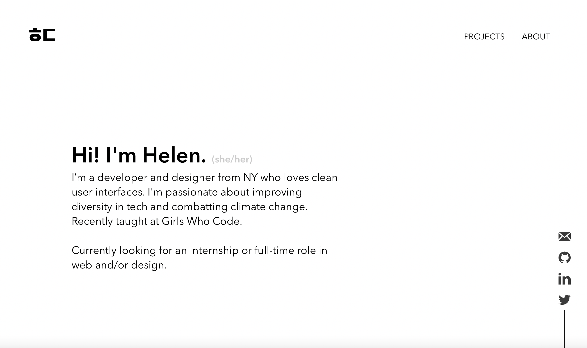

# helen-dempsey.com

This is the second iteration of my website. My first website can be found here: https://hpdempsey.com/

‼️ This website is still in progress ‼️

## Installation and setup

1. Make sure you have the latest versions of `npm` and `react` installed. If you don't have either:

- [npm](https://www.npmjs.com/get-npm)
- [React](https://reactjs.org/docs/getting-started.html)

If you already have npm installed, you can update it by running

`npm update -g`

This page explains how to update React: https://www.kirupa.com/react/updating_react_version.htm

2. Clone or download this repository

- To access it through your CLI, do

`cd Directory` (e.g., `cd Downloads/personal-site-master`)

## To run

1. For development, run

`npm start`

2. For production build, run

`npm run build`

3. To preview the site as it appears deployed, run

`npm run serve`

You can learn more in the [Create React App documentation](https://facebook.github.io/create-react-app/docs/getting-started).

